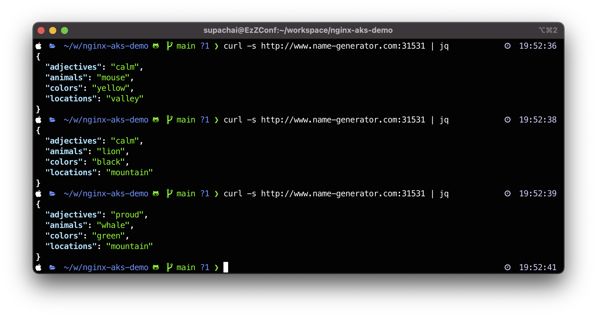

# คำอธิบาย

ในส่วนของ Task, เราจะทำการเรียนรู้ในการ Deploy ตัว App ที่เป็น Docker โดยใช้งานบน K8s/k3s/Volttera หรือบนระบบ Kubernetes ต่างๆ ได้

ขั้นการติดตั้งและโครงสร้างต่างๆ ของโปรแกรมสุ่มคำ

  

## การติดตั้งโปรแกรมสุ่มคำแบบคอนเทนเนอร์ ที่เป็นไมโครเซอร์วิส

เริ่มต้น ทำการติดตั้ง 4 คอนเทนเนอร์ สำหรับโปรแกรมสุ่มคำต่างๆ ที่เป็นไมโครเซอร์วิส
- locations
- animals
- adjectives
- colors

ทำการ Clone Repo :
```
git clone https://github.com/fchmainy/nginx-aks-demo.git
```

## ทำการตั้งติดพร้อมกันทั้งหมดแบบ All-in-One ดังนี้
มีการสร้างไฟล์ YAML deployment สำหรับ 4 ไมโครเซอร์วิส (pods + services)

ทำการสร้าง namespace:
```
kubectl create namespace api
kubectl create namespace front
kubectl create namespace ingress
```
ใช้คำสั่งบนระบบ Kubernetes:

```
kubectl apply -f ./k8s/attributes/all_attributes.yaml -n api
```

คำสั่งข้างต้นจะเป็นการติดตั้ง 4 `PODS` และ 4 `SERVICES` เป็น **ClusterIP** โหมด โดยทุก services จะ listen ด้วยพอร์ต 80 และ `POD` ทั้งหมดจะเป็นพอร์ต 8080.

## การติดตั้งโปรแกรม Generator
โปรแกรม Generator เป็นโปรแกรมพัฒนาโดยใช้ python แล้วเรียกเข้าไปที่ 4 ไมโครเซอร์วิสที่สุ่มคำส่งกลับมาให้ ซึ่ง POD จะเปิดพอร์ต **8080** และ Services จะเปิดพอร์ต **80**

```
vi k8s/attributes/generator-direct.yaml
```
ทำการแก้ไขไฟล์ YAML deployment ด้วยค่าของ `NAMESPACE` ซึ่งค่าของ  `NAMESPACE` เป็นที่ตัว 4 ไมโครเซอร์วิส ติดตั้งอยู่ก่อนหน้านี้ เพราะ `generator` ต้องสามารถเชื่อมต่อไปเพื่อไปเรียกข้อมูลแต่ละเซอร์วิสใน K8S ได้
```
......
        imagePullPolicy: Always
        ports:
        - containerPort: 8080
        env:
        - name: NAMESPACE
          value: api  <--------แก้ไขตาม NAMESPACE ที่ 4 pod อยู่

```

> ตัวอย่าง การเรียกไมโครเซอร์วิส ด้วย `generator` โดยได้รับ color word: 
curl http://colors.api/colors

> `Colors` คือ service name, `api` คือ namespace

จากนั้น ใช้คำสั่งในการ deploy ดังนี้
```
kubectl apply -f ./k8s/attributes/generator-direct.yaml -n api
```
> จะสังเกตเห็นว่ามี 2 kind ของ `generator` deployment  โดยจะมีไฟล์ YAML deployment อื่นๆ ที่ติดตั้ง API Gateway  ให้ระหว่าง `generator` และ `words` services.

## ทำการติดตั้ง Frontend application (webapp)

สุดท้ายเราจะติดตั้งตัว `web application` ที่มีการเรียกไปที่ `generator`.  ซึ่งกรณีนี้ web application อาจจะไม่ได้ใช้ในกรณีที่เราทดสอบเรื่อง API demo/use case.

```
vi .k8s/attributes/frontend-namespace-generator.yaml
```
แก้ไขไฟล์ YAML deployment โดยระบุค่า `NAMESPACE` เป็นค่าตามของ `generator`. ซึ่ง web application สามารถที่จะถูกติดตั้งใน namespace อื่นๆ ได้ แต่ web application ต้องสามารถเชื่อมต่อหรืออ้างอิง `generator` ได้

ตัวอย่าง
```
    spec:
      containers:
      - name: frontend
        image: registry.gitlab.com/sentence-application/frontend/frontend-ns-8080:latest
        imagePullPolicy: Always
        ports:
        - containerPort: 8080
        env:
        - name: NAMESPACE
          value: api     <----- กำหนด namespace ที่ generator อยู่
```

ใช้คำสั่งติดตั้ง web application 
```
kubectl apply -f ./k8s/attributes/frontend-namespace-generator.yaml
```

## ทำการ Publish ตัว Services ต่างๆ 

ถ้าต้องการให้สามารถเรียก เข้าไปหา web application `frondend` หรือตัวที่เป็น `generator` บน K8S ได้นั้น สามารถแก้ไขไฟล์ YAML deployment จาก `ClusterIP` ไปเป็น `NodePort`. 

ตัวอย่างการ Publish ตัว `Frontend` ให้สามารถเข้ามาเรียกใช้งานได้ จาก ข้างนอก

```
---
apiVersion: v1
kind: Service
metadata:
  name: frontend
spec:
  type: NodePort <--------- เปลี่ยนจาก ClusterIP เป็น NodePort โลด
  ports:
  - port: 80
    targetPort: 8080
  selector:
    app: frontend
```

ทำการดู port ที่ใช้โดย `NodePort` (เนื่องจากเราไม่ได้กำหนดพอร์ตสำหรับ Nodeport ระบบจะกำหนดมาให้ค่าเริ่มต้นจะอยู่ที่ 30000-32767 เด้อ)

```
kubectl get services
```

> จากนั้นเราก็สามารถเข้าถึงจาก **http://node_IP:NodePort**

ตัวอย่างลองทดสอบ Publish ตัว `Web Application` ผ่านทาง NodePort เปิด browser 

ตัวอย่างลองทดสอบ Publish ตัว `Generator` ผ่านทาง NodePort  ลองใช้ curl เรียก เข้าไปตรงๆ 


## ทำการสร้าง NGINX Ingress Controller บน Kubernetes

ปกติแล้ว Ingress Controller จะไม่ได้ถูกติดตั้งมาให้ โดยทำการติดตั้ง NGINX Ingress Controller โดยอ้างอิงจาก https://kubernetes.github.io/ingress-nginx/deploy/#bare-metal

```
kubectl apply -f https://raw.githubusercontent.com/kubernetes/ingress-nginx/controller-v0.46.0/deploy/static/provider/baremetal/deploy.yaml
```
ลองตรวจสอบดูว่า ติดตั้งเรียบร้อยแล้วหรือยังโดย
```
root@k8s-node01:/# kubectl get pods -n ingress-nginx -l app.kubernetes.io/name=ingress-nginx --watch

NAME                                        READY   STATUS      RESTARTS   AGE
ingress-nginx-admission-create-llnk4        0/1     Completed   0          91m
ingress-nginx-admission-patch-bc89f         0/1     Completed   0          91m
ingress-nginx-controller-55bc4f5576-bb5ts   1/1     Running     0          91m
```
จะสังเกตเห็นว่ามี ingress-nginx-controller เป็น 1/1 ถือว่า ทำงานแล้ว

จากนั้นก็ทำการ สร้างไฟล์ สำหรับ deploy ingress ของ `frontend` ที่อยู่ namespace `front` และ `generator` ที่อยู่ namespace `api` ดังนี้ 

```
apiVersion: extensions/v1beta1
kind: Ingress
metadata:
  name: ingress-name-generator
  namespace: front
  annotations:
    kubernetes.io/ingress.class: nginx
    nginx.ingress.kubernetes.io/ssl-redirect: "false"
    nginx.ingress.kubernetes.io/rewrite-target: /
spec:
  rules:
  - http:
      paths:
      - path: /
        backend:
          serviceName: frontend
          servicePort: 80
---
apiVersion: extensions/v1beta1
kind: Ingress
metadata:
  name: ingress-name-generator
  namespace: api
  annotations:
    kubernetes.io/ingress.class: nginx
    nginx.ingress.kubernetes.io/ssl-redirect: "false"
    nginx.ingress.kubernetes.io/rewrite-target: /
spec:
  rules:
  - http:
      paths:
      - path: /api/v1
        backend:
          serviceName: generator
          servicePort: 80
```
หมายเหตุ: ในตัวอย่างมีการแอบมีเรื่อง URL Rewrite ตรง `nginx.ingress.kubernetes.io/rewrite-target: /`  เช่น เรียกเข้ามาด้วย /api/v1 จะถูก rewrite ด้วย / นะครับ เพราะ `generator` ไม่ได้มีการเตรียม /api/v1 ไว้ นั้นเอง

เสร็จแล้วก็ apply บน k8s
``` 
kubectl apply -f ingress-fronend-generator.yaml
```
ลองดูว่า เรียบร้อยแล้วหรือยัง และตรวจสอบดูว่า ingress-nginx-controller ตัว NodePort เปิดพอร์ต (Port) อะไร?
```
kubectl get ingress -A
kubectl get svc -n ingress-nginx
```


ตรวจสอบดูว่าแต่ละ Ingress Resource เป็นยังไงบ้าง 
```
kubectl describe ingress ingress-name-generator -n front
kubectl describe ingress ingress-name-generator -n api
```


ทดสอบ เรียกเข้าไปหา `frontend` และ `generator` ได้เลย


